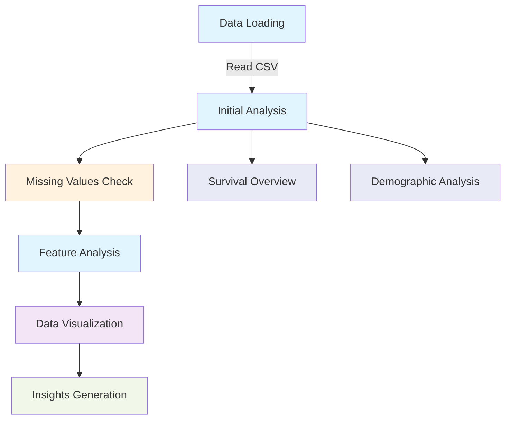
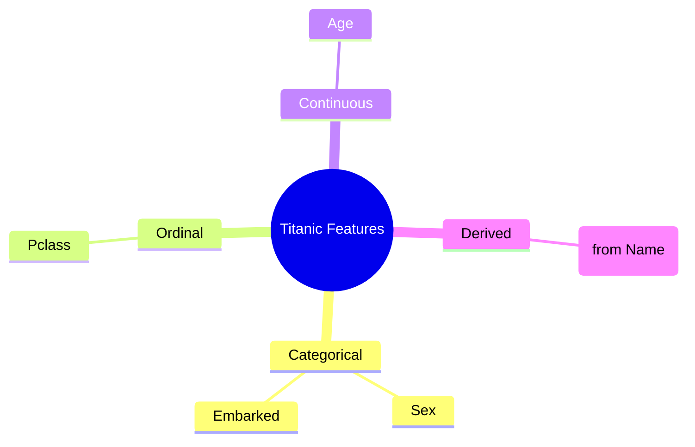
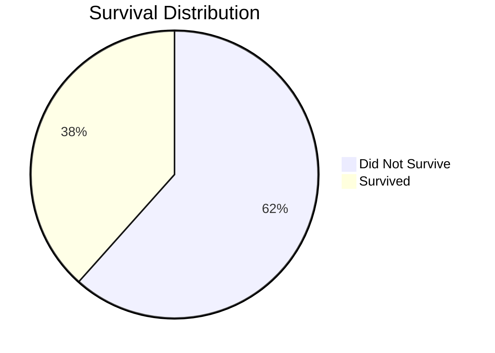
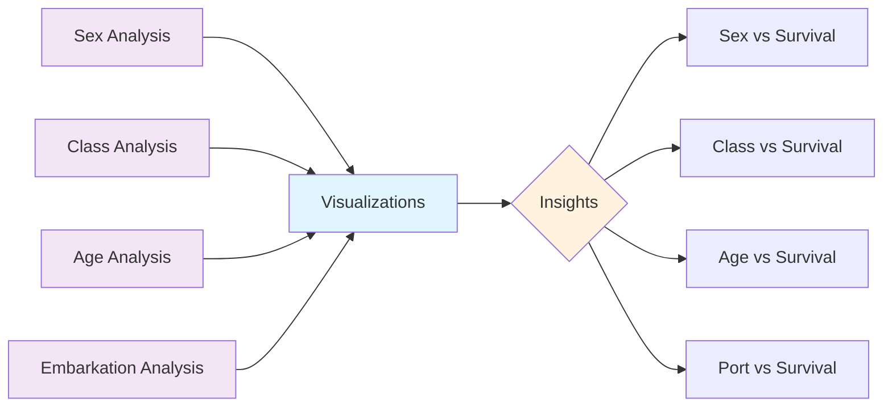
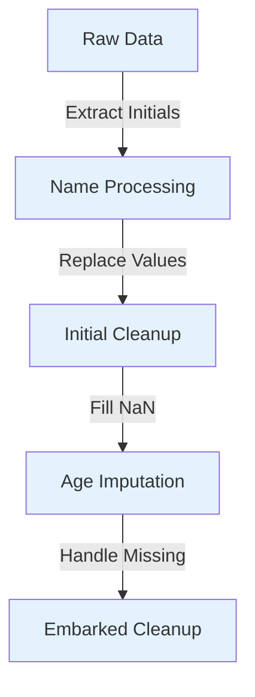
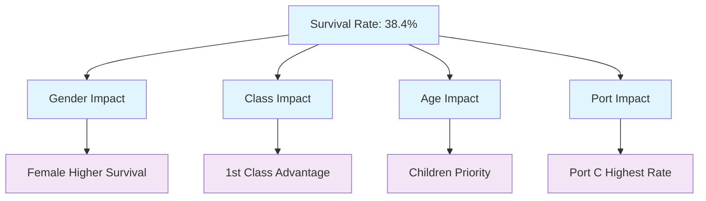

# EDA-to-Prediction-DieTitanic-
# 🚢 Titanic Survival Analysis

A comprehensive analysis of the Titanic dataset using Python, focusing on survival patterns and passenger demographics.

## 📊 Analysis Workflow



## 🛠️ Dependencies

```python
import numpy as np 
import pandas as pd
import matplotlib.pyplot as plt
import seaborn as sns
plt.style.use('fivethirtyeight')
```

## 📋 Feature Types



## 🔍 Analysis Components

### 1. Survival Overview



```python
f,ax=plt.subplots(1,2,figsize=(18,8))
data['Survived'].value_counts().plot.pie(explode=[0,0.1],autopct='%1.1f%%',ax=ax[0],shadow=True)
```

### 2. Demographic Analysis Pipeline



## 📈 Key Visualizations

### 1. Gender Analysis
```python
f,ax=plt.subplots(1,2,figsize=(18,8))
data[['Sex','Survived']].groupby(['Sex']).mean().plot.bar()
```

### 2. Class Analysis
```python
pd.crosstab(data.Pclass,data.Survived,margins=True)
```

### 3. Age Distribution
```python
sns.violinplot("Pclass","Age", hue="Survived", data=data,split=True)
```

### 4. Embarkation Analysis
```python
sns.factorplot('Embarked','Survived',data=data)
```

## 🔧 Data Processing Steps



### Initial Extraction
```python
data['Initial']=data.Name.str.extract('([A-Za-z]+)\.')
```

### Age Imputation
```python
# Mean age by Initial title
data.groupby('Initial')['Age'].mean()

# Fill missing values
data.loc[(data.Age.isnull())&(data.Initial=='Mr'),'Age']=33
data.loc[(data.Age.isnull())&(data.Initial=='Mrs'),'Age']=36
```

## 📊 Key Findings



## 📝 Statistical Highlights

- **Age Range**: 0.42 to 80 years
- **Average Age**: ~29.7 years
- **Class Distribution**: 
  - 1st Class: 24.2%
  - 2nd Class: 20.3%
  - 3rd Class: 55.5%

## 🎯 Usage

1. Install required libraries:
```bash
pip install pandas numpy matplotlib seaborn
```

2. Load and prepare data:
```python
data = pd.read_csv('train.csv')
```

3. Run analysis cells in order:
   - Data cleaning
   - Feature extraction
   - Visualization generation
   - Statistical analysis

## 📌 Notes

- All visualizations use seaborn and matplotlib
- Missing values are handled systematically
- Age imputation is based on passenger title
- Port of embarkation missing values are filled with most common value ('S')

---
*This README uses Mermaid diagrams for visualization. Ensure your Markdown viewer supports Mermaid syntax.*
